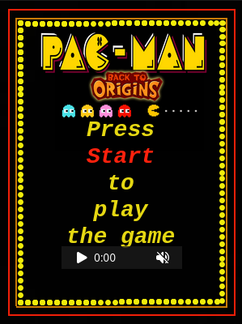
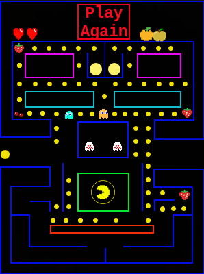

# AIB(Português)
Trabalho da disciplina de Aplicações Informáticas B no ano letivo 2022/2023 da Escola Secundária de Vila Verde.

Simulação do jogo de 1980, **PacMan**.

<p align="center">
  
</p>

## Instruções para ver a animação

### Unzip Projeto.zip

Faça unzip do ficheiro Projeto.zip

```console
$ unzip Projeto.zip
```

### Abrir o ficheiro html

A animação pode ser vista abrindo o ficheiro html num navegador ou executando o comando abaixo.

```console
$ xdg-open index.html 2>/dev/null
```

### Informação adicional

Para começar clique em **"Start"**.

Após o término da animação, é possível recomeçar clicando em **"Play Again"**.

<p align="center">
  
</p>

# AIB (English)

Project for the subject "Aplicações Informáticas B" during the 2022/2023 academic year at Escola Secundária de Vila Verde.

Simulation of the 1980 game, **PacMan**.

<p align="center">
  
</p>

## Instructions to View the Animation

### Unzip Projeto.zip

Unzip the file `Projeto.zip`:

```console
$ unzip Projeto.zip
```

### Open the HTML File

The animation can be viewed by opening the HTML file in a web browser or by running the command below:

```console
$ xdg-open index.html 2>/dev/null
```

### Additional Information

To start the animation, click **"Start"**.

After the animation ends, you can restart it by clicking **"Play Again"**.

<p align="center">
  
</p>
